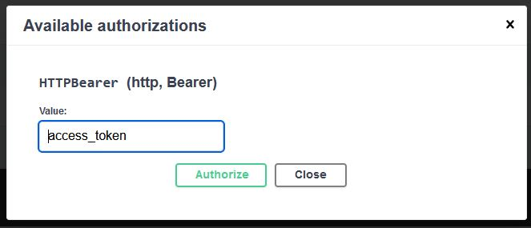

# Backend test for Got It company

## **Installation**
### **Requirement**
* Python (>= 3.8)
* MariaDB (MySQL should work fine)
### **Setup**
* Install pipenv
```console
  pip install pipenv
```
* Make an empty `.venv` folder to store dependencies
```console
  mkdir .venv
```
* Install dependencies
```console
  pipenv install
```
* Create a database name `backend_test`
* Change content of .env file to correct database information (user, password, host, port)
* Run migrate database
```console
  pipenv run python migrate.py
```
* Start the server
```console
  pipenv run uvicorn main:app
```
* Now we can go to <a href="http://localhost:8000/docs" target="_blank">localhost:8000/docs</a> to see all the api
### **Explain**
* To login to system

Go to <a href="http://localhost:8000/login" target="_blank">localhost:8000/login</a> and try login using `google` or `facebook` button.

After that, open browser console, get the access_token and send to correspond url
```
[POST] /api/login/google
{
  "access_token": "google_access_token"
}
```
```
[POST] /api/login/facebook
{
  "access_token": "facebook_access_token"
}
```
-> After this step save the `access_token` and fill in `Authorize`



* Provide additional information (do this before access other API)
```
[PATCH] /api/users/self
{
  "name": "string",
  "phone_number": "012354578",
  "occupation": "string"
}
```
* To write a new post
```
[POST] /api/posts
{
  "title": "string",
  "body": "string"
}
```
* To like a post
```
[POST] /api/posts/{post_id}/likes
```
* Show list all posts in homepage. All likes will be sorted from latest to oldest order
```
[GET] /api/posts?page=1
```
* Show all posts by a specific user
```
[GET] /api/users/{user_id}/posts
```
* Get a specific post
```
[GET] /api/posts/{post_id}
```
